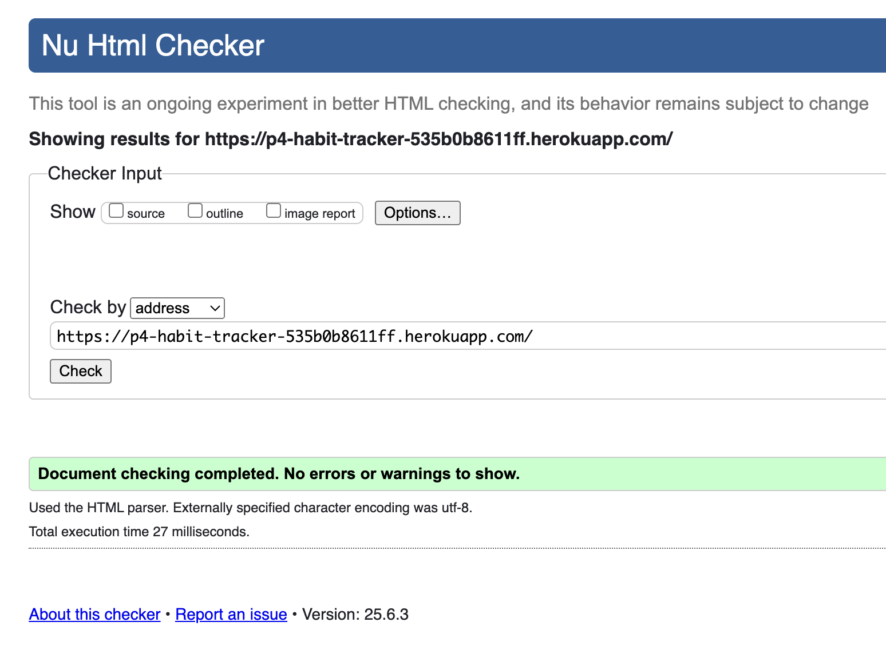
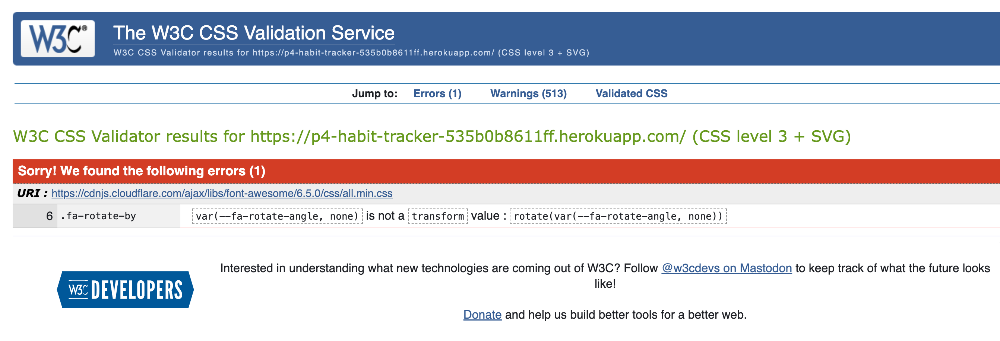

# Habit Tracker

**Habit Tracker** is a full-stack Django web application designed to help users build better habits by tracking their daily progress and monitering this over time. Developed as part of my Milestone Project 4 for the Code Institute's Full Stack Software Developer course. This project showcases the culmination of all modules covered throughout the programme. 

## Purpose
The purpose of this app is to support users in forming positive habits and maintaining consistency. Users can create and manage their own habits, track their completion using an intuitive calendar, and unlock motivational badges as they progress.

## User Stories 

## Technologies Used

### Languages
- **Python 3.13.1** – Back-end language used with Django.
- **HTML5** – Language for structuring web pages.
- **CSS3** – Styling language used to design and style the frontend.
- **JavaScript** – Used for dynamic interactivity and data visualisation.

### Frameworks & Libraries
- **Django** 
- **Bootstrap 5** – Front-end framework used for responsive design and layout.
- **Google Charts** – Used to visually represent user habit progress.
- **Font Awesome** – Provides icon for links

### Database
- **SQLite3** – Default development database used with Django ORM for storing user data, habits, and completions.

### Version Control & Development Tools
- **Git** – Local version control system used to manage changes.
- **GitHub** – Remote repository and collaboration platform.
- **Visual Studio Code** – Code editor used for development.
- **GitHub Projects / Issues** – Used for managing Agile workflow and user stories.

### Deployment & Hosting
- **Heroku** – Platform-as-a-Service (PaaS) used for deploying the live application.
- **Gunicorn** – WSGI HTTP server for running Django apps on Heroku.
- **Whitenoise** – Serves static files in production without needing a separate web server.

## User Stories 

### Generic (Guest/Public) User

- As a Guest User, I want to easily register for an account so I can start tracking my habits.

### Registered (Logged-In) User

- As a Registered User, I want to add new habits so I can build healthy routines.
- As a Registered User, I want to mark my habits as completed on a calendar so I can track my consistency.
- As a Registered User, I want to view visual charts of my habit progress so I can stay motivated.
- As a Registered User, I want to unlock badges when I hit milestones so I feel accomplished.
- As a Registered User, I want to receive reminders for when I am behind on habits to stay on track.
- As a Registered User, I want to edit or delete my habits if my routine changes.
- As a Registered User, I want to view all the badges I’ve unlocked 
- As a Registered User, I want to log out securely when I’m done using the app.

### Site Administrator

- As a Site Administrator, I want to assign badges so users can earn them by completing habits.


### Developer (Project Author)

- As a Developer, I want to build a secure, scalable Django app that uses both front-end and back-end features.
- As a Developer, I want to demonstrate my ability to manage users, authentication, and admin logic.
- As a Developer, I want to apply clean UI/UX principles so the app looks professional and is easy to navigate.
- As a Developer, I want to use GitHub for version control with clear commits to demonstrate my development process.
- As a Developer, I want to complete the project using Agile principles and user stories, so it’s clear and well-managed.


## Features
This Habit Tracker project was developed using **Django 4** in conjunction with **Bootstrap 5**, making it a fully responsive and mobile-first app. The application was built as part of **Project 4 (Full Stack Frameworks with Django)**. It draws on all prior modules and integrates both frontend and backend technologies into a single, functioning web app.

Python 3.13.1 was used as the base language, and the project was managed in **Visual Studio Code** with Git and GitHub for version control. The project uses Django’s built-in templating system, URL routing, authentication tools, and Object-Relational Mapping to manage data through a SQLite3 database.

The frontend was built using HTML5, CSS3, JavaScript, and Bootstrap 5, while dynamic user interactions and progress visuals were implemented with JavaScript and Google Charts.

<details>
  <summary><strong>The project boasts a wide range of features:</strong></summary>

<br/>

### User Registration, Login & Authentication
- Django’s built-in authentication system allows users to register, log in, and log out securely.
- Custom messages guide users through successful or failed login/logout attempts.
- Access to habit management is restricted to logged-in users only.
- Logged-in users are automatically redirected to their dashboard, while unauthenticated users are prevented from accessing protected routes such as the sidebar.

### Habit Management (CRUD)
- Users can create new habits by specifying a name, frequency, and target completion values.
- Full CRUD functionality is available:
  - **Create** a habit
  - **Read/View** habits in a list or calendar
  - **Update** habits (e.g. editing habit names)
  - **Delete** habits individually
- Habit data is stored in the SQLite3 database and tied specifically to the user account that created it.

### Calendar View & Daily Progress Tracking
- Each user sees a calendar grid with daily habit tracking.
- ✅ indicates a completed habit for the day, ❌ indicates a missed one.
- Navigation toggles allow users to move between calendar months.
- Habit completion is stored per day, allowing Django to calculate weekly/monthly progress accurately.

### Badge System for Motivation
- Badges act as motivational incentives, rewarding users for consistency.
- e.g. badge types:
  - **30-Day Streak Badge**: Automatically awarded after marking a habit as complete for 30 consecutive days.
- Badges have "Locked" and "Unlocked" states. Users can view both in their badge panel.
- Badges are linked to models and stored in the database, allowing users to persist achievements.

### Google Charts Integration
- Weekly habit completion data is displayed using Google Charts.
- Charts are dynamically generated based on user activity and habit data passed from Django views to JavaScript.
- This provides users with a clear, visual representation of their consistency and progress.


### Success Messages

The app uses Django’s built-in messages framework to show feedback to users when actions are completed successfully. These messages include:

- ✅ Habit added successfully!
- Habit deleted successfully!


Messages are styled with Bootstrap alert classes and appear at the top of the screen. They fade out automatically after a few seconds using JavaScript, so users don't need to click to dismiss them.

---

### Reminder Emails

The app includes a custom reminder system that checks for incomplete habits and sends reminder emails to users. 

- 🕓 Emails are triggered manually using:
  ```bash
  python3 manage.py send_reminders
</details>

## Structure 
The Habit Tracker app consists of multiple templates, each responsible for a specific user-facing feature. All templates extend from base.html except for login.html and register.htnl. 

### base.html
This is the shared base template extended by all other pages. It includes:

- The site-wide navigation bar
- Conditional content based on authentication using

``

    <!-- Show authenticated content -->

    <!-- Show guest links -->

``

### dashboard.html
This is the main page after login. It displays:

- A personalised greeting
- Motivational quote
- Today’s habits with checkboxes
- Google Charts for weekly and category-based habit progress
- Pinned user notes

### calendar.html

- Displays a calendar view with ✅ and ❌ icons to show if habits were completed or missed.
- Data is updated via JavaScript and synced with the backend using the Fetch API.
- Includes habit and date filters.

### habit_list.html

- Displays all user-created habits.
- Each habit entry includes its name, frequency, category, and target
- Users can edit or delete habits.
- Includes feedback messages for actions like delete.

### add_habit.html

- A form for creating new habits.
- Validates required fields.

Fields include:
- Habit name
- Category
- Frequency (e.g., Daily)
- Target number of days

### badges.html

- Displays a collection of user-earned and locked badges.
- Uses a badge system to gamify habit completion.

### add_note.html

- Allows users to add and save notes.
- Notes can be pinned to the dashboard.

### register.html

- Page for user registration.

Displays error messages for:
- Existing username
- Invalid email
- Password mismatch

On success, user is redirected to the dashboard.

### login.html

- Page for user login.
- Displays validation errors for incorrect username/password.
- Includes link to register if the user doesn't have an account.


## Testing

### Browsers
The site was manually tested on the following browsers:
- Google Chrome (v125+)
- Safari (macOS + iOS)

On Google Chrome, responsiveness was checked using Chrome DevTools with multiple screen sizes (mobile, tablet, desktop).

---

### Frontend Testing

#### HTML

<details>
<summary> View HTML W3C Markup Validator </summary>



</details>

- Validated using [W3C Markup Validator](https://validator.w3.org/).

#### CSS

<details>
<summary> View CSS W3C Markup Validator </summary>



</details>

- Validated using [W3C CSS Validator](https://jigsaw.w3.org/css-validator/).
- **1 error** was found in the Font Awesome CDN (`all.min.css`) related to a CSS variable not being recognised as a valid transform value. This is a known issue and does not affect site functionality.
- **513 warnings** were mostly from external libraries such as Bootstrap and Font Awesome. These include:
  - Vendor-specific properties (e.g. `-webkit-`, `-moz-`) used for cross-browser compatibility.
  - CSS variables, which cannot be statically checked by the validator.
  - Deprecated properties like `clip` and `break-word`.

These warnings are expected when using modern frameworks and third-party libraries. Custom CSS was reviewed to ensure it follows best practices and is standards-compliant.


#### Manual User Flow Tests
| Functionality | Test Outcome |
|--------------|---------------|
| Navigation links (Home, Dashboard, Register, Login) | ✅ All links worked correctly and routed to intended pages |
| Register new account | ✅ Account created, redirected to dashboard |
| Login/logout | ✅ Verified successful and unsuccessful login attempts |
| Add new habit | ✅ Form saved valid data; form errors appeared for missing/invalid fields |
| Calendar habit checkboxes | ✅ Toggled correctly and saved completion data via Fetch API |
| Chart updates on checkbox changes | ✅ Weekly progress chart updated dynamically with no page refresh |
| Badge unlock system | ✅ 30-day streak badge unlocked after marking streaks in the database |

---

### Backend Testing
#### Django
All backend logic was tested manually and via the Django shell (`python3 manage.py shell`).

**User Authentication Checks:**
- Used `request.user.is_authenticated` in templates to display appropriate content:
  ```django
  
    <p>Welcome, {{ user.username }}!</p>
  
    <a href="/login/">Sign in</a>
  
  ```
- Prevented access to certain pages unless the user was logged in.

**Database Testing with Shell:**
- Created habits manually:
  ```python
  from habits.models import Habit
  from django.contrib.auth.models import User
  user = User.objects.get(username="testuser")
  Habit.objects.create(name="Exercise", user=user, frequency="daily", target=30)
  ```
- Marked habits completed via `HabitCompletion` model:
  ```python
  from habits.models import HabitCompletion
  from datetime import date
  hc = HabitCompletion.objects.create(habit=habit, date=date.today())
  ```
- Tested badge logic manually:
  ```python
  from badges.models import Badge, UserBadge
  UserBadge.objects.filter(user=user).update(unlocked=True)
  ```

### JavaScript (Google Charts)
| Feature | Manual Test Outcome |
|---------|----------------------|
| Google Charts on dashboard | ✅ Renders with live habit completion data |
| Chart updates after marking habits | ✅ Data updates via JavaScript and chart redraws successfully |
| Chart fetch and display errors | ✅ Console logs show successful fetch and render |

**Testing snippet used:**
```js
fetch('/get-habit-data/')
  .then(response => response.json())
  .then(data => drawChart(data));
```

---

### Bugs
- Heroku deployment failed initially due to missing config vars → fixed
- Static file path conflicts → resolved by cleaning duplicate filenames
- App crashed due to missing `DEFAULT_FROM_EMAIL` → fixed by setting dummy vars

### Email Functionality Testing

This project uses Django’s built-in email system for email confirmations. Although email sending is not a core feature of the app due to a lack of time, the configuration must be valid to prevent deployment issues.

### Configuration Issue on Heroku

During deployment to Heroku, the application crashed due to missing environment variables required for Django’s email settings. 

<details>
<summary>The error was identified using the Heroku CLI:</summary>


```
heroku logs --tail
```

The logs revealed the following error:

```
decouple.UndefinedValueError: DEFAULT_FROM_EMAIL not found. Declare it as envvar or define a default value.
```

This was caused by the following environment-dependent email settings in settings.py, which use decouple.config():

```
EMAIL_HOST = config('EMAIL_HOST')
EMAIL_PORT = config('EMAIL_PORT', cast=int)
EMAIL_USE_TLS = config('EMAIL_USE_TLS', cast=bool)
EMAIL_HOST_USER = config('EMAIL_HOST_USER')
EMAIL_HOST_PASSWORD = config('EMAIL_HOST_PASSWORD')
DEFAULT_FROM_EMAIL = config('DEFAULT_FROM_EMAIL')
```

Since these variables were not defined in Heroku's Config Vars, Django raised an error and the app crashed.
</details>


Solution
To resolve the issue, dummy environment variable values were added in the Heroku dashboard:

1. Go to my Heroku app.
2. Navigate to Settings → Reveal Config Vars.
3. Add the following keys and dummy values:

### Heroku Email Config Vars (Dummy Values)

| Key                  | Value                  |
|----------------------|------------------------|
| EMAIL_HOST           | smtp.gmail.com         |
| EMAIL_PORT           | 587                    |
| EMAIL_USE_TLS        | True                   |
| EMAIL_HOST_USER      | test@example.com       |
| EMAIL_HOST_PASSWORD  | dummy-password         |
| DEFAULT_FROM_EMAIL   | noreply@example.com    |

> **Note:** These are placeholder values added purely to allow successful deployment. No actual email functionality is active in the deployed app.

---

All other features functioned as expected after thorough manual and shell-based testing.

### Result

After adding the above config vars:

- The app booted successfully on Heroku.  
- The `python manage.py collectstatic --noinput` command completed without errors.  
- The Heroku deployment pipeline ran successfully and the live site was accessible again.

This resolved the deployment blocker and allowed the project to be submitted successfully.


## Deployment

This Habit Tracker full-stack web application was developed using **Visual Studio Code** and version controlled with **Git** (locally) and **GitHub** (remotely). Deployment was carried out using **Heroku**, with production settings managed via environment variables and the Config Vars feature provided by the Heroku dashboard.

### Environment Variables

To keep sensitive information safe, secret keys and configuration values were stored in an `env.py` file locally, which was added to the `.gitignore` file to ensure it was not committed to the public repository.

These values were then manually entered into **Heroku** under:

<details>
<summary> Click to view detailed Heroku deployment steps (with commands & screenshots)</summary>

<br>

###  Steps to Deploy on Heroku

#### 1. Project Setup

- Installed **Gunicorn** for WSGI support and updated requirements:
    ```bash
    pip3 install gunicorn
    pip3 freeze > requirements.txt
    ```

- Created a `Procfile` at the project root (no file extension, case-sensitive):
    ```
    web: gunicorn p4_habit_tracker.wsgi
    ```

- Added and committed it:
    ```bash
    git add Procfile
    git commit -m "Add Procfile for Heroku deployment"
    ```

- Installed **Whitenoise** to serve static files:
    ```bash
    pip3 install whitenoise
    pip3 freeze > requirements.txt
    ```

- Updated `settings.py` middleware:
    ```python
    MIDDLEWARE = [
        "django.middleware.security.SecurityMiddleware",
        "whitenoise.middleware.WhiteNoiseMiddleware",  # 👈 Add this line just below SecurityMiddleware
        ...
    ]
    ```

- Updated `STATIC_ROOT` in `settings.py`:
    ```python
    STATIC_ROOT = BASE_DIR / "staticfiles"
    ```

#### 2. Preparing for Deployment

- Ran collectstatic locally to make sure static files are ready:
    ```bash
    python3 manage.py collectstatic --noinput
    ```

- Confirmed files appeared in `/staticfiles/` and ensured only one copy of `styles.css` and `script.js` was in the correct folder.

#### 3. Pushing to Heroku

- Logged into Heroku CLI:
    ```bash
    heroku login
    ```

- Created a new Heroku app:
    ```bash
    heroku create p4-habit-tracker
    ```

- Added the Heroku remote (if needed):
    ```bash
    heroku git:remote -a p4-habit-tracker
    ```

- Deployed the app:
    ```bash
    git push heroku main
    ```

#### 4. Config Vars and Environment Settings

- In the Heroku dashboard:
  - Navigated to **Settings > Config Vars**
  - Added the following:
    ```
    SECRET_KEY: your-django-secret-key
    DEBUG: False
    ```

#### 5. Final Setup Commands

- Ran migrations and created a superuser:
    ```bash
    heroku run python3 manage.py migrate
    heroku run python3 manage.py createsuperuser
    ```

- Optionally removed this (added earlier during testing):
    ```bash
    heroku config:unset DISABLE_COLLECTSTATIC
    ```

- If static files weren't showing up earlier:
    ```bash
    heroku run python3 manage.py collectstatic --noinput
    ```

- Scaled dynos (if required):
    ```bash
    heroku ps:scale web=1
    ```

---

✅ **Live Site**: [https://p4-habit-tracker-535b0b8611ff.herokuapp.com/](https://p4-habit-tracker-535b0b8611ff.herokuapp.com/)

</details>

## Credits & Acknowledgements

### Acknowledgements
- Developed by **Aisha** as part of the [Diploma in Full Stack Software Development](https://codeinstitute.net/).

- Due to time constraints towards the end of the project, significant assistance was provided by [ChatGPT](https://openai.com/chatgpt) by OpenAI to help with debugging, code generation, and feature implementation.

### Third-Party Tools & Resources

The following tools, libraries, and resources were used in the development of this project:

- [Django](https://www.djangoproject.com/) – Python web framework used for backend logic and data handling.
- [Bootstrap](https://getbootstrap.com/) – CSS framework for responsive layout and UI styling.
- [Google Fonts](https://fonts.google.com/) – Custom font styles.
- [Google Charts](https://developers.google.com/chart) – For visualising habit progress and statistics.
- [FontAwesome](https://fontawesome.com/) – Icon library used throughout the application.
- [Heroku](https://www.heroku.com/) – Hosting and deployment platform.
- [GitHub](https://github.com/) – Version control and project repository hosting.
- [VS Code](https://code.visualstudio.com/) – Code editor used during development.
